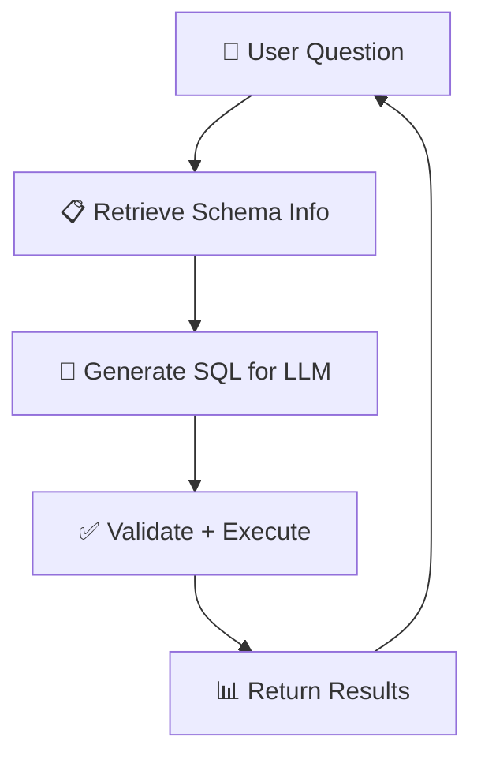

# text-to-sql-chatbot-with-rag

## The RAG Loop in Action: A simple flow diagram with the following loop.

```mermaid
flowchart TD
    A[👤 User Question] --> B[📋 Retrieve Schema Info]
    B --> C[🤖 Generate SQL  for LLM]
    C --> D[✅ Validate + Execute]
    D --> E[📊 Return Results]
    E --> A
```
