# Text-to-SQL Chatbot with RAG

A powerful chatbot that converts natural language questions into SQL queries using Retrieval-Augmented Generation (RAG). Ask questions in plain English and get structured database results instantly.

## 🌟 Features

- **Natural Language Processing**: Convert everyday questions into precise SQL queries
- **RAG Architecture**: Retrieves relevant schema information to generate accurate queries
- **Real-time Validation**: SQL syntax validation before execution
- **Web Interface**: Clean and intuitive Streamlit UI
- **API Access**: FastAPI backend for programmatic access
- **Query History**: Keep track of your previous queries
- **Export Results**: Download query results as CSV files

## 🏗️ Architecture

The RAG Loop in Action:

```mermaid
flowchart TD
    A[👤 User Question] --> B[📋 Retrieve Schema Info]
    B --> C[🤖 Generate SQL for LLM]
    C --> D[✅ Validate + Execute]
    D --> E[📊 Return Results]
    E --> A
```



## 🚀 Quick Start

### Prerequisites

- Python 3.8+
- [uv](https://docs.astral.sh/uv/) package manager
- SQLite database
- Google AI API key (for Gemini)

### Installation

1. **Clone the repository**

   ```bash
   git clone https://github.com/eiAlex/text-to-sql-chatbot-with-rag.git
   cd text-to-sql-chatbot-with-rag
   ```

2. **Install dependencies**

   ```bash
   uv sync
   ```

3. **Set up environment variables**

   Create a `.env` file in the root directory:

   ```env
   LLM_MODEL=gemini-pro
   LLM_API_KEY=your_google_ai_api_key_here
   DATABASE_PATH=./data/your_database.db
   ```

4. **Prepare your database**

   - Place your SQLite database in the `data/` directory
   - Run the ingestion pipeline to create vector embeddings:

   ```bash
   uv run ingest_pipeline.py
   ```

### Running the Application

#### Option 1: Web Interface (Streamlit)

```bash
uv run streamlit run ui.py
```

Access the web interface at: `http://localhost:8501`

#### Option 2: API Server (FastAPI)

```bash
uv run python api.py
```

API documentation available at: `http://localhost:8000/docs`

#### Option 3: Direct Query Service

```python
from query_service import query, QueryRequest

request = QueryRequest(question="How many customers do we have?")
result = query(request)
print(result)
```

## 📁 Project Structure

```text
text-to-sql-chatbot-with-rag/
├── api.py                  # FastAPI server
├── ui.py                   # Streamlit web interface
├── query_service.py        # Main query processing service
├── retriever_node.py       # RAG retrieval component
├── sql_node.py            # SQL generation with LLM
├── sql_validator.py       # SQL syntax validation
├── sql_executor.py        # Database query execution
├── ingest_pipeline.py     # Vector database creation
├── data/
│   └── vector_store/      # ChromaDB vector storage
└── scripts/
    └── create_xpto_db.py  # Sample database creation
```

## 🔧 Configuration

### Environment Variables

| Variable | Description | Default |
|----------|-------------|---------|
| `LLM_MODEL` | Google AI model name | `gemini-pro` |
| `LLM_API_KEY` | Google AI API key | Required |
| `DATABASE_PATH` | Path to SQLite database | `./data/database.db` |

### Supported Query Types

- **Aggregation**: "How many sales were made?"
- **Filtering**: "Show customers from New York"
- **Sorting**: "Top 10 products by revenue"
- **Grouping**: "Sales by month"
- **Joins**: "Customer orders with product details"

## 📊 Example Usage

### Web Interface

1. Open `http://localhost:8501`
2. Type your question: "What are our top-selling products?"
3. View the generated SQL and results
4. Download results as CSV if needed

### API Request

```bash
curl -X POST "http://localhost:8000/query" \
     -H "Content-Type: application/json" \
     -d '{"question": "How many orders were placed last month?", "show_sql": true}'
```

### Response

```json
{
  "success": true,
  "sql": "SELECT COUNT(*) as total_orders FROM orders WHERE DATE(created_at) >= DATE('now', '-1 month')",
  "cols": ["total_orders"],
  "rows": [{"total_orders": 150}]
}
```

## 🛡️ Security Features

- **SQL Injection Protection**: Only SELECT statements allowed
- **Table Validation**: Queries limited to allowed tables
- **Syntax Validation**: SQL validated before execution
- **Read-only Access**: No INSERT/UPDATE/DELETE operations

## 🤝 Contributing

1. Fork the repository
2. Create your feature branch (`git checkout -b feature/AmazingFeature`)
3. Commit your changes (`git commit -m 'Add some AmazingFeature'`)
4. Push to the branch (`git push origin feature/AmazingFeature`)
5. Open a Pull Request

## 📄 License

This project is licensed under the MIT License - see the [LICENSE](LICENSE) file for details.

## 🆘 Troubleshooting

### Common Issues

#### API Connection Failed

- Ensure the API server is running on port 8000
- Check if your API key is correctly set in the `.env` file

#### No Results Returned

- Verify your database path is correct
- Check if the vector store is properly created
- Ensure your question relates to existing table schemas

#### SQL Generation Errors

- Make sure your database schema is properly indexed in the vector store
- Try rephrasing your question more specifically

### Getting Help

- Open an issue on GitHub
- Check existing issues for solutions
- Review the API documentation at `/docs`

---

Made with ❤️ using LangChain, Streamlit, and FastAPI
